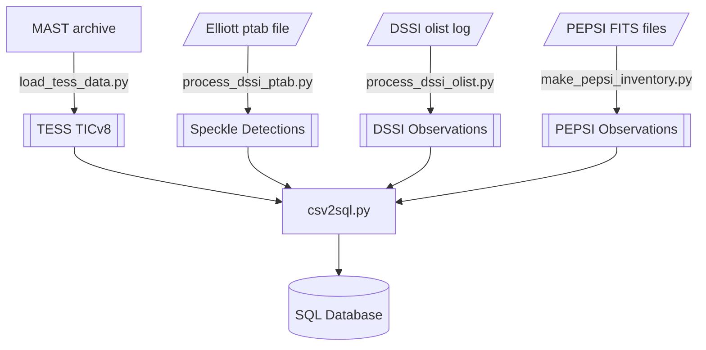

```mermaid
graph TD;
    mast[MAST archive] -- load_tess_data.py --> tess[[TESS TICv8]] --> csv2sql.py
    ptab[/Elliott ptab file/] -- process_dssi_ptab.py --> detections[[Speckle Detections]] --> csv2sql.py
    olist[/DSSI olist log/] -- process_dssi_olist.py --> dssi[[DSSI Observations]] --> csv2sql.py
    pepsi[/PEPSI FITS files/] -- make_pepsi_inventory.py --> pepob[[PEPSI Observations]] --> csv2sql.py
    csv2sql.py --> ZZ[(SQL Database)] 
```